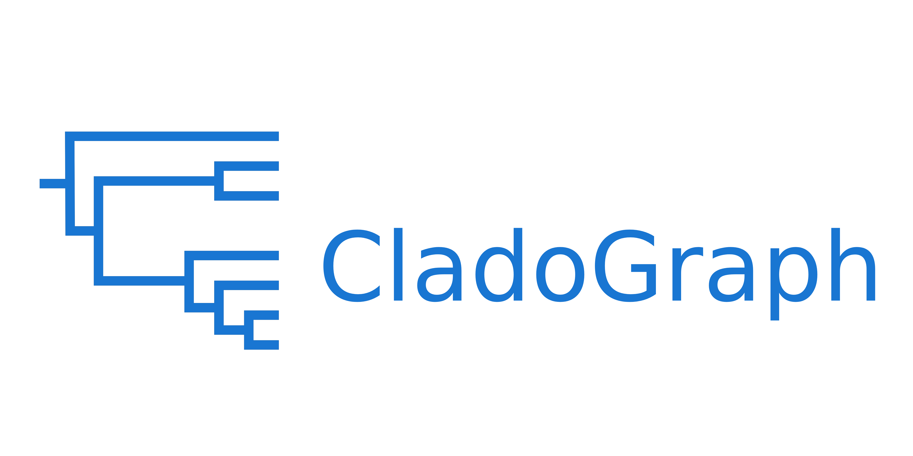

## 🌐 Socials:
   

# ✏️ Outros Projetos:
### CladoGraph:

# 💻 Tech Stack:
                       
# 📊 GitHub Stats:
<!--   ->>
<!--   -->

<!-- Proudly created with GPRM ( https://gprm.itsvg.in ) -->
